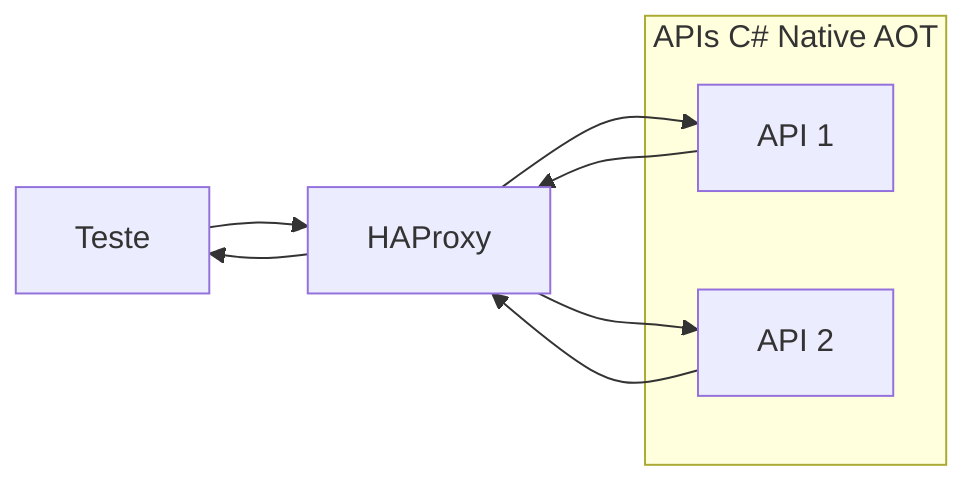

# Rinha de Backend 2026 - C# AOT + FAISS (Facebook AI Similarity Search)

## Visão geral

Arquitetura distribuída composta por duas APIs em C# compiladas com Native AOT e busca vetorial utilizando FAISS diretamente nas APIs .NET 10.

Repositório oficial da Rinha de Backend 2026 com instruções para a execução do teste:
- https://github.com/zanfranceschi/rinha-de-backend-2026

Artigos sobre o desafio e insights:

- https://micheloliveira.com/blog/reduzindo-latencia-rinha-de-backend-2026-faiss-direto-nas-apis-dotnet/
- https://micheloliveira.com/blog/desafio-performance-rinha-backend-2026-insights-csharp-faiss/

## Características

- ASP.NET Core Minimal APIs Native AOT
- FAISS integrado via bindings nativos
- Busca ANN utilizando índice IVF
- Armazenamento vetorial em FP16
- APIs independentes com balanceamento via HAProxy
- Escalabilidade horizontal
- Baixa latência para a busca vetorial
- Índice carregado em memória (se não existe, é gerado) no startup

---

## Arquitetura



---

## Componentes

### APIs (C# Native AOT)

- Duas instâncias stateless
- Compilação Ahead-of-Time (AOT)

Responsabilidades:

- Receber requisições HTTP
- Normalizar os dados
- Executar busca vetorial FAISS
- Retornar resposta final

---

### HAProxy

- round-robin

---

## Fluxo de requisição

1. Teste k6 envia a requisição para o HAProxy
2. HAProxy distribui para API 1 ou API 2
3. API processa requisição vetorizada
4. API executa busca vetorial FAISS
5. API retorna resposta final via HAProxy

---

## Executando via docker-compose (ambiente restrito conforme as regras do desafio):
```bash
cd src/
docker compose up -d
```

## Endpoints expostos conforme a documentação oficial do desafio na porta 9999:
- https://github.com/zanfranceschi/rinha-de-backend-2026/blob/caa53569a03b4c85fa07ae9bdd40f995b9826aa2/docs/br/README.md

## Execução em modo de desenvolvimento

### Pré-requisitos para o FAISS:
#### Windows
```
winget install --id Microsoft.VCRedist.2015+.x64 --silent
```
#### Linux (Debian based)
```
sudo apt-get install -y libopenblas0 libgomp1 libgfortran5
```
#### macOS
```
brew install libomp
```

### APIs C#

Workspace / Solution:

```bash
src/rinha-de-backend-2026-dotnet-csharp.code-workspace
src/rinha-de-backend-2026-dotnet-csharp.sln
```

---

### Resources oficiais base da execução

```bash
src/backend/Resources/references.json.gz
src/backend/Resources/mcc_risk.json
src/backend/Resources/normalization.json
```

---

### Resources gerados com a base oficial references.json.gz

```bash
src/backend/Resources/train/references.faiss
src/backend/Resources/train/labels.bin
```

---